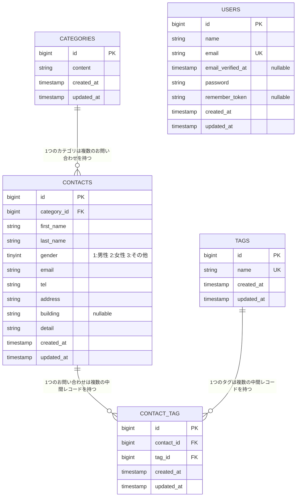

# COACHTECH お問い合わせフォーム

## 概要

coachtechの確認テストとして作成した、お問い合わせの受付・管理を行うWebアプリケーションです。一般ユーザー向けの「お問い合わせフォーム」と、管理者向けの「管理画面」、外部連携用の「公開API」の3つの機能で構成されています。

- **お問い合わせフォーム（公開・認証不要）**: カテゴリ・タグを選択してお問い合わせを送信できます。入力 → 確認 → 完了の3画面構成です。
- **管理画面（要ログイン）**: 受け付けたお問い合わせの一覧表示・キーワード/性別/カテゴリ/日付での絞り込み・詳細表示・削除、およびタグの追加・編集・削除ができます。検索条件を引き継いだCSVエクスポートも可能です。
- **公開API（`/api/v1/contacts`）**: 認証なしでお問い合わせデータをCRUD操作できるREST APIです。

## ER図



- `categories` 1 : 多 `contacts`（1つのカテゴリに複数のお問い合わせが紐づく）
- `contacts` 多 : 多 `tags`（中間テーブル `contact_tag` を介して多対多）
- `users` は管理者ログイン専用で、他テーブルとの外部キー関連はありません。

# 環境構築手順

# 1.Laravelプロジェクトの作成（Laravel 10.x)

注意: curl -s "https://laravel.build/..." は最新版のLaravelをインストールするため、今回は使用しません。

以下のDockerコマンドを実行して、Laravel 10.xを明示的に指定してプロジェクトを作成します。

# Laravel 10.x を指定してプロジェクトを作成

docker run --rm \
 -u "$(id -u):$(id -g)" \
 -v "$(pwd):/var/www/html" \
 -w /var/www/html \
 -e COMPOSER_CACHE_DIR=/tmp/composer_cache \
 laravelsail/php82-composer:latest \
 composer create-project laravel/laravel:^10.0 contact-form-app

# 2. Laravel Sailのインストール

プロジェクト作成後、contact-form-app ディレクトリに移動し、Laravel Sailをインストールします。

- # プロジェクトディレクトリに移動

cd contact-form-app

- # Laravel Sailをインストール

docker run --rm \
 -u "$(id -u):$(id -g)" \
 -v "$(pwd):/var/www/html" \
 -w /var/www/html \
 -e COMPOSER_CACHE_DIR=/tmp/composer_cache \
 laravelsail/php82-composer:latest \
 composer require laravel/sail --dev

- # Sailの設定ファイルをパブリッシュ（MySQLを選択）

docker run --rm \
 -u "$(id -u):$(id -g)" \
 -v "$(pwd):/var/www/html" \
 -w /var/www/html \
 -e COMPOSER_CACHE_DIR=/tmp/composer_cache \
 laravelsail/php82-composer:latest \
 php artisan sail:install --with=mysql

- # ※M1/M2/M3 Mac（Apple Silicon）をお使いの方

Apple Silicon搭載のMacでは、`sail up -d`実行時に以下のエラーが発生することがあります：

```
no matching manifest for linux/arm64/v8
```

解決方法: `compose.yaml`を開き、mysqlサービスに`platform: 'linux/amd64'`を追加してください。
mysql:
image: 'mysql/mysql-server:8.0'
platform: 'linux/amd64' # ← この行を追加
ports:

- # 3..evnファイルの設定
    　.env ファイルを開き、データベース接続情報が以下と一致していることを確認します。

DB_CONNECTION=mysql
DB_HOST=mysql
DB_PORT=3306
DB_DATABASE=laravel
DB_USERNAME=sail
DB_PASSWORD=password

重要: DB_HOST は localhost や 127.0.0.1 ではなく、Dockerコンテナ名である mysql を指定します。

# 4. フロントエンドのセットアップ (Vite & Tailwind CSS)

　本プロジェクトでは、フロントエンドのスタイリングにTailwind CSSを使用します。

- ## 4-1. NPM依存パッケージのインストール

> 重要: sail npm install を実行する前に、必ずSailコンテナが起動していることを確認してください。
> sail npm install

- ## 4-2. Tailwind CSSのインストール

    sail npm install -D tailwindcss@^3.4.0 postcss autoprefixer
    sail npm install alpinejs

- ## 4-3. 設定ファイルの生成

    sail npx tailwindcss init -p

- ## 4-4. Tailwind CSSのテンプレートパス設定

    tailwind.config.js を開き、以下のように設定します。
    /** @type {import("tailwindcss").Config} \*/
    export default {
    content: [
    "./resources/**/_.blade.php",
    "./resources/\*\*/_.js",
    "./resources/\*_/_.vue",
    ],
    theme: {
    extend: {},
    },
    plugins: [],
    }

- ## 4-5. 提供リポジトリのresourcesディレクトリと入れ替え
    以下のリポジトリをクローンし、resourcesディレクトリを丸ごと入れ替えます。
    git clone https://github.com/coachtech-prepared-file/Preparedblade-ConfirmationTest-ContactForm.git

入れ替え手順:
① Finderでプロジェクトフォルダを開きます。
open .
② プロジェクト内の resources フォルダを削除します。
③ クローンしたリポジトリ内の resources フォルダをプロジェクト直下にコピーします。

※コマンド操作に慣れている場合は rm -rf と cp -r でも可能ですが、誤削除を防ぐためFinderでの操作を推奨します。

- ## 4-6. Vite開発サーバーの起動
    sail npm run dev
    注意: sail npm run dev は実行したままにしておく必要があります。
    3.phpMyasminの追加
    　ompose.yaml を開き、mysql サービスの後に以下の設定を追加してください。

compose.yaml に追加する内容:

    phpmyadmin:
        image: 'phpmyadmin:latest'
        ports:
            - '${FORWARD_PHPMYADMIN_PORT:-8080}:80'
        environment:
            PMA_HOST: mysql
            PMA_USER: '${DB_USERNAME}'
            PMA_PASSWORD: '${DB_PASSWORD}'
        networks:
            - sail
        depends_on:
            - mysql

# 5. phpMyAdminの追加

compose.yaml を開き、mysql サービスの後に以下の設定を追加してください。

compose.yaml に追加する内容:

    phpmyadmin:
        image: 'phpmyadmin:latest'
        ports:
            - '${FORWARD_PHPMYADMIN_PORT:-8080}:80'
        environment:
            PMA_HOST: mysql
            PMA_USER: '${DB_USERNAME}'
            PMA_PASSWORD: '${DB_PASSWORD}'
        networks:
            - sail
        depends_on:
            - mysql

# 6. Sailの起動とエイリアス設定

- # Sailをバックグラウンドで起動

./vendor/bin/sail up -d

- # エイリアスを設定して 'sail' だけでコマンドを実行できるようにする

echo "alias sail='[ -f sail ] && bash sail || bash vendor/bin/sail'" >> ~/.zshrc

- # または bash の場合

- # echo "alias sail='[ -f sail ] && bash sail || bash vendor/bin/sail'" >> ~/.bashrc

- # シェルを再起動するか、新しいターミナルを開いてエイリアスを有効にする

exec $SHELL

# 7.アプリケーションキーの生成

　ルートで以下のコマンドを実行する
sail artisan key:generate

# 8. データベースのマイグレーションと初期データ投入

　以下のコマンドでテーブルを作成し、初期データを投入します。
sail artisan migrate --seed

※既存のデータベースをリセットしたい場合は以下を実行してください。
sail artisan migrate:fresh --seed

⚠️ 日本語化／翻訳について:
— 日本語化は FormRequest の `messages()` と `lang/ja`（認証系）で行います。
`laravel-lang/*` 系の外部翻訳パッケージ（`composer require laravel-lang/...`）は導入しないでください。
同系パッケージは 2026年5月のサプライチェーン攻撃でマルウェア配布に悪用された経緯があり、本課題では不要です。

起動後、`http://localhost` でアプリケーションにアクセスできます。管理画面へは以下のシードユーザーでログインできます。

- メールアドレス: `test@example.com`
- パスワード: `password`

### テストの実行

```bash
./vendor/bin/sail artisan test
```

## 使用技術

| カテゴリ       | 技術                                             |
| -------------- | ------------------------------------------------ |
| 言語           | PHP 8.5（Sail実行環境）                          |
| フレームワーク | Laravel 10.10                                    |
| 認証           | Laravel Fortify                                  |
| DB             | MySQL 8.4                                        |
| Webサーバー    | Nginx（Sailコンテナ内）                          |
| フロントエンド | Blade, Vite, Tailwind CSS 3.4, Alpine.js         |
| 開発環境       | Docker, Docker Compose, Laravel Sail, phpMyAdmin |
| テスト         | PHPUnit                                          |
| コード整形     | Laravel Pint                                     |

## APIエンドポイント一覧

`/api/v1/contacts` に対する認証不要のCRUD APIです（`routes/api.php`）。

| メソッド    | パス                         | 概要                                                                                         |
| ----------- | ---------------------------- | -------------------------------------------------------------------------------------------- |
| GET         | `/api/v1/contacts`           | お問い合わせ一覧を取得（キーワード・性別・カテゴリ・日付での絞り込み、ページネーション対応） |
| GET         | `/api/v1/contacts/{contact}` | お問い合わせ詳細を取得                                                                       |
| POST        | `/api/v1/contacts`           | お問い合わせを新規作成                                                                       |
| PUT / PATCH | `/api/v1/contacts/{contact}` | お問い合わせを更新（タグの紐付けもsyncされる）                                               |
| DELETE      | `/api/v1/contacts/{contact}` | お問い合わせを削除                                                                           |

## 開発環境URL

| 用途             | URL                              |
| ---------------- | -------------------------------- |
| アプリケーション | http://localhost                 |
| 管理画面         | http://localhost/admin           |
| 公開API          | http://localhost/api/v1/contacts |
| phpMyAdmin       | http://localhost:8080            |

## 作成者

手塚 誉幸
