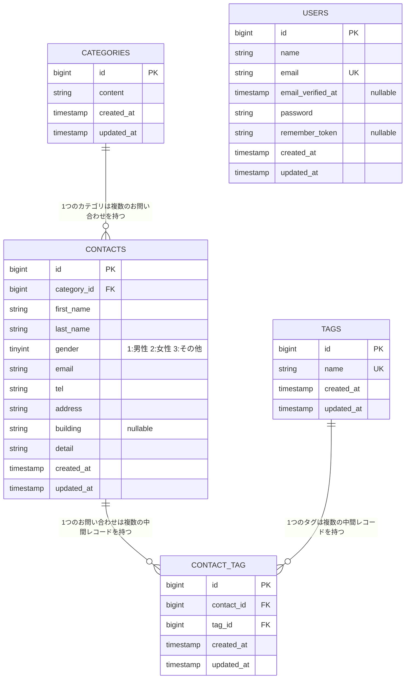

# COACHTECH お問い合わせフォーム

## 概要

coachtechの確認テストとして作成した、お問い合わせの受付・管理を行うWebアプリケーションです。一般ユーザー向けの「お問い合わせフォーム」と、管理者向けの「管理画面」、外部連携用の「公開API」の3つの機能で構成されています。

- **お問い合わせフォーム（公開・認証不要）**: カテゴリ・タグを選択してお問い合わせを送信できます。入力 → 確認 → 完了の3画面構成です。
- **管理画面（要ログイン）**: 受け付けたお問い合わせの一覧表示・キーワード/性別/カテゴリ/日付での絞り込み・詳細表示・削除、およびタグの追加・編集・削除ができます。検索条件を引き継いだCSVエクスポートも可能です。
- **公開API（`/api/v1/contacts`）**: 認証なしでお問い合わせデータをCRUD操作できるREST APIです。

## ER図



- `categories` 1 : 多 `contacts`（1つのカテゴリに複数のお問い合わせが紐づく）
- `contacts` 多 : 多 `tags`（中間テーブル `contact_tag` を介して多対多）
- `users` は管理者ログイン専用で、他テーブルとの外部キー関連はありません。

## 環境構築手順

このプロジェクトは Laravel Sail（Docker）で動作します。あらかじめ Docker Desktop 等を起動しておいてください。

```bash
# 1. リポジトリを取得
git clone https://github.com/tezuka0/confirm-test.git
cd confirm-test

# 2. 環境変数ファイルを準備
cp .env.example .env
```

`.env` のDB接続情報が以下と一致していることを確認してください（Sailのデフォルト値です）。

````
DB_CONNECTION=mysql
DB_HOST=mysql
DB_PORT=3306
DB_DATABASE=laravel
DB_USERNAME=sail
DB_PASSWORD=password

```bash
# 3. Composerの依存パッケージをインストール
docker run --rm \
  -u "$(id -u):$(id -g)" \
  -v "$(pwd):/var/www/html" \
  -w /var/www/html \
  laravelsail/php82-composer:latest \
  composer install --ignore-platform-reqs

# 4. Sailでコンテナを起動（初回はイメージのビルドが走ります）
./vendor/bin/sail up -d
````

※ Apple Silicon（M1/M2/M3）Macで `no matching manifest for linux/arm64/v8` エラーが出る場合は、`compose.yaml` の `mysql` サービスに `platform: 'linux/amd64'` を追加してください。

```bash
# 5. アプリケーションキーを生成
sail artisan key:generate

# 6. マイグレーションとシーディングを実行
sail artisan migrate:fresh --seed

# 7. フロントエンドの依存パッケージをインストールしてビルド
sail npm install
sail npm run build
```

起動後、`http://localhost` でアプリケーションにアクセスできます。管理画面へは以下のシードユーザーでログインできます。

- メールアドレス: `test@example.com`
- パスワード: `password`

### テストの実行

```bash
sail artisan test
```

### コードスタイルチェック（Pint）

Laravel Pint はartisanコマンドではなく、Sailが直接プロキシする独立のバイナリです。コミット前に実行してください。

```bash
sail pint --test
```

## 使用技術

| カテゴリ       | 技術                                             |
| -------------- | ------------------------------------------------ |
| 言語           | PHP 8.2（Sail実行環境）                          |
| フレームワーク | Laravel 10.10                                    |
| 認証           | Laravel Fortify                                  |
| DB             | MySQL 8.0                                        |
| Webサーバー    | Nginx（Sailコンテナ内）                          |
| フロントエンド | Blade, Vite, Tailwind CSS 3.4, Alpine.js         |
| 開発環境       | Docker, Docker Compose, Laravel Sail, phpMyAdmin |
| テスト         | PHPUnit                                          |
| コード整形     | Laravel Pint                                     |

## APIエンドポイント一覧

`/api/v1/contacts` に対する認証不要のCRUD APIです（`routes/api.php`）。

| メソッド    | パス                         | 概要                                                                                         |
| ----------- | ---------------------------- | -------------------------------------------------------------------------------------------- |
| GET         | `/api/v1/contacts`           | お問い合わせ一覧を取得（キーワード・性別・カテゴリ・日付での絞り込み、ページネーション対応） |
| GET         | `/api/v1/contacts/{contact}` | お問い合わせ詳細を取得                                                                       |
| POST        | `/api/v1/contacts`           | お問い合わせを新規作成                                                                       |
| PUT / PATCH | `/api/v1/contacts/{contact}` | お問い合わせを更新（タグの紐付けもsyncされる）                                               |
| DELETE      | `/api/v1/contacts/{contact}` | お問い合わせを削除                                                                           |

## 開発環境URL

| 用途             | URL                              |
| ---------------- | -------------------------------- |
| アプリケーション | http://localhost                 |
| 管理画面         | http://localhost/admin           |
| 公開API          | http://localhost/api/v1/contacts |
| phpMyAdmin       | http://localhost:8080            |

## 作成者

手塚 誉幸
